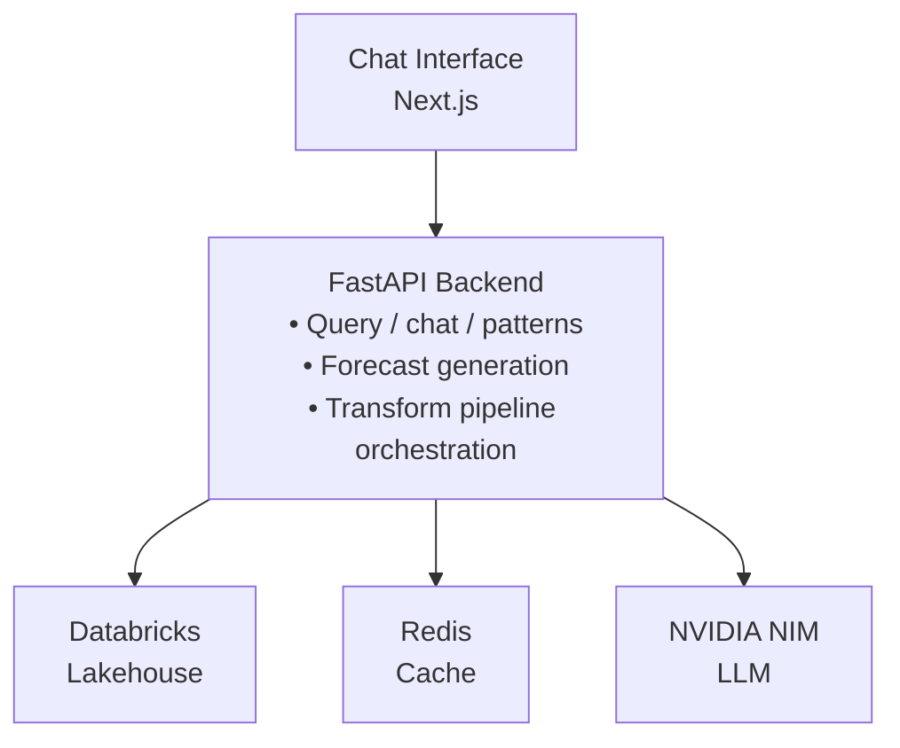

## DataToad – Conversational Business Intelligence for Sales Patterns

DataToad is a full-stack Business Intelligence application that lets business users explore sales patterns and forecasts through a conversational interface. It combines Databricks, advanced time-series signal processing (STFT, wavelets, Hilbert–Huang Transform), and an LLM hosted via NVIDIA NIM to surface actionable insights.

---

## What It Is

- **Conversational BI assistant** — Ask natural language questions about sales patterns, trends, spikes, dips, volatility, and seasonality
- **Pattern mining on Databricks** — Reads precomputed pattern metadata and raw sales data from your Databricks Lakehouse
- **Pattern-aware forecasting** — Generates future sales projections and translates them into business language via the LLM
- **Transform pipeline** — Triggers a Databricks job to (re)compute pattern metadata or run a local transform pipeline for testing
- **Caching** — Redis-backed cache for faster repeated queries and forecasts

---

## Architecture



- **Frontend**: Next.js 14 app with a single-page conversational UI
- **Backend**: FastAPI handles queries, forecasting, and pipeline runs
- **Data layer**: Databricks stores pattern metadata, sales data, and forecasts
- **LLM**: NVIDIA NIM for natural language summaries and explanations
- **Cache**: Redis for repeated queries

For details, see `docs/ARCHITECTURE.md`.

---

## How to Use

### Local setup

**Prerequisites:** Python 3.10+, Node.js 18+, Redis, Databricks workspace, NVIDIA NIM API key

**Backend**

```bash
git clone https://github.com/Pshyam17/DataToad.git
cd DataToad

python -m venv venv
source venv/bin/activate  # Windows: venv\Scripts\activate
pip install -e .
```

Create a `.env` file with Databricks, NVIDIA NIM, and Redis credentials. Run:

```bash
uvicorn src.api.main:app --reload --host 0.0.0.0 --port 8000
```

**Frontend**

```bash
cd frontend
npm install
```

Create `frontend/.env.local` with `NEXT_PUBLIC_API_URL="http://localhost:8000"`. Run:

```bash
npm run dev
```

Open `http://localhost:3000` in your browser.

### Using the interface

- **Pattern questions** — e.g. “Show me products trending up”, “Find products with spikes in the last quarter”
- **Forecasts** — e.g. “Forecast sales for Product_123 for the next 6 months”
- **Pipeline runs** — e.g. “Run the pattern analysis pipeline”

Use the quick filters (“Trending up”, “Spikes”, “Volatile”) above the input, or type questions directly.

---

## Deploy to Vercel

The frontend (Next.js) can be deployed to Vercel. The backend must be hosted separately (e.g. Railway, Render, or a container service) and its URL configured in the frontend.

### 1. Connect the repo

1. Go to [vercel.com](https://vercel.com) and sign in
2. Click **Add New** → **Project**
3. Import the `Pshyam17/DataToad` GitHub repository
4. Vercel will detect Next.js (the project has `vercel.json` with `rootDirectory: "frontend"`)

### 2. Configure build settings

- **Framework preset:** Next.js
- **Root directory:** `frontend`
- **Build command:** `npm run build` (default)
- **Output directory:** `.next` (default)

### 3. Set environment variables

In **Settings → Environment Variables**, add:

| Variable | Value | Notes |
|----------|-------|-------|
| `NEXT_PUBLIC_API_URL` | `https://your-backend-url.com` | Your deployed FastAPI backend URL |

### 4. Deploy

- Click **Deploy**
- Vercel builds and deploys the frontend
- Use the provided Vercel URL (e.g. `https://datatoad.vercel.app`)

### 5. Backend requirement

The backend (FastAPI) must be deployed and reachable at the URL set in `NEXT_PUBLIC_API_URL`. It needs access to Databricks, Redis, and NVIDIA NIM. Deploy it to Railway, Render, or a similar service, then update the environment variable and redeploy the Vercel project if needed.
